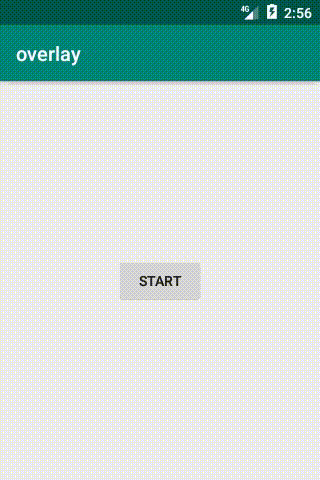

# Rendering Over Other Apps With OpenGL on Android
In this sample I'm using OpenGL ES 2.0 to draw over other apps and Android system UI.

This project is related to my blog post about using system overlay windows on Android. You can find more information at the following link

<a href="https://sisik.eu/blog/android/other/overlay">www.sisik.eu/blog/android/other/overlay</a>

# License
Whole project is licensed under the Apache License 2.0 **except** for the **bugjaeger_icon.png** file. 
The bugjaeger_icon.png contains the icon of the Bugjaeger app. You can use the icon png file for presentational purposes within this project, but you need to clearly state that it is part of the Bugjager app and give the following link to the app's store listing

<a href="https://play.google.com/store/apps/details?id=eu.sisik.hackendebug">https://play.google.com/store/apps/details?id=eu.sisik.hackendebug</a> 